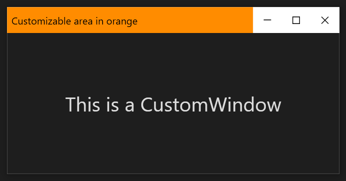

# [CustomWindow](Docs/CustomWindow.md)
It is a window that allows customization of the non-client area, has a kiosk mode and has a mechanism for displaying modal content.

<table>
  <tr>
    <td>
        
    </td>
    <td>
        
    </td>
  </tr>

  <tr>
    <td>
        
    </td>
    <td>
        
    </td>
  </tr>
  <tr>
    <td colspan="2">
        
    </td>
  </tr>
</table>
 